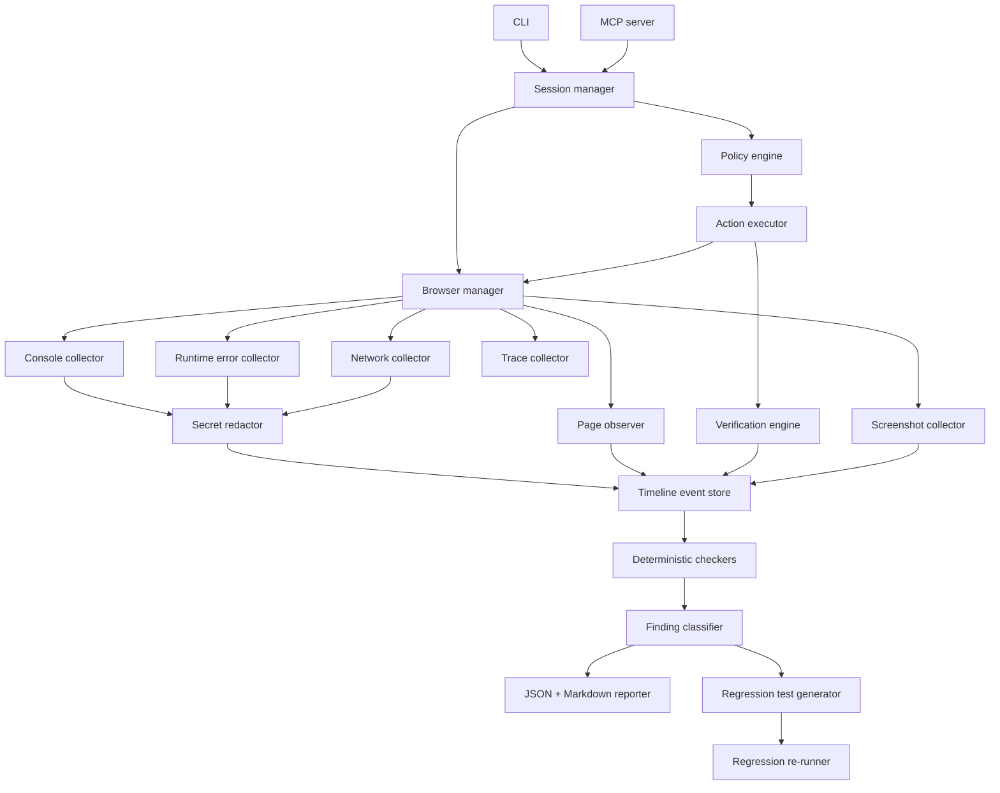

# WebCheck Agent — Lean MVP Implementation Plan

## 0. Mục tiêu của kế hoạch

Xây dựng **WebCheck Agent**, một công cụ kiểm tra frontend chạy local, có thể được sử dụng qua:

* CLI.
* MCP server cho Claude Code, Cursor, Codex và các coding agent khác.

WebCheck Agent sẽ:

1. Mở website localhost hoặc staging được cho phép.
2. Quan sát giao diện qua DOM và accessibility snapshot.
3. Thực hiện user flow từng bước.
4. Thu thập console, runtime error, network, screenshot và Playwright trace.
5. Liên kết toàn bộ bằng chứng theo timeline và action.
6. Phát hiện một số nhóm lỗi frontend có bằng chứng rõ ràng.
7. Sinh báo cáo Markdown và JSON.
8. Sinh Playwright regression test cho các lỗi có thể tái hiện ổn định.
9. Chạy lại test để xác nhận bug còn tồn tại hoặc đã được sửa.

MVP không nhằm thay thế QA, không nhằm kiểm tra mọi loại lỗi frontend và không phải browser agent tổng quát.

Giá trị cốt lõi:

> Coding agent không chỉ tuyên bố website đã chạy, mà phải cung cấp bằng chứng website thực sự hoạt động hoặc chỉ ra chính xác flow nào thất bại.

---

# 1. Product scope

## 1.1 Người dùng mục tiêu

* Người sử dụng Claude Code, Cursor hoặc Codex.
* Developer làm dự án React hoặc Next.js.
* Indie developer và vibe coder.
* Nhóm nhỏ chưa có QA riêng.
* Developer muốn kiểm tra lại website sau khi agent sửa code.

## 1.2 Use case chính của MVP

```text
Developer hoặc coding agent vừa sửa một chức năng.

WebCheck:
1. Mở localhost.
2. Thực hiện user flow.
3. Thu console và network.
4. Kiểm tra kết quả giao diện.
5. Báo lỗi kèm bằng chứng.
6. Sinh regression test nếu tái hiện được.
```

Ví dụ:

```text
URL: http://localhost:3000

Goal:
- Đăng nhập bằng tài khoản test.
- Mở dashboard.
- Chuyển sang notebooks.
- Quay lại dashboard.
- Dashboard không được mất dữ liệu hoặc loading lại bất thường.
```

---

# 2. MVP boundaries

## 2.1 MVP hỗ trợ

* Chromium.
* Một browser context trên mỗi run.
* Một tab.
* Localhost.
* Staging domain được allowlist rõ ràng.
* React và Next.js.
* Scripted flow.
* Host-agent flow qua MCP.
* Click.
* Fill.
* Select.
* Press.
* Scroll.
* Navigate.
* Wait.
* DOM và accessibility snapshot.
* Console log.
* Runtime exception.
* Network request và response metadata.
* Screenshot.
* Playwright trace.
* Timeline NDJSON.
* Báo cáo JSON và Markdown.
* Một số deterministic checker cốt lõi.
* Sinh regression test cho ba nhóm lỗi chính.
* Controlled CAPTCHA test bypass trên local hoặc staging thuộc quyền kiểm soát.

## 2.2 MVP không hỗ trợ

* Embedded LLM planner riêng.
* Multi-agent.
* Multi-tab phức tạp.
* Firefox và WebKit.
* Cloud browser.
* SaaS dashboard.
* GitHub Action chính thức.
* Pixel-perfect visual regression.
* Phân tích memory leak sâu.
* Tự động sửa source code.
* Tự deploy.
* Điều khiển browser profile cá nhân.
* Production data mặc định.
* Thanh toán.
* CAPTCHA solver.
* Bypass CAPTCHA trên website bên thứ ba.
* Tự động thực hiện destructive action.
* Tự phát hiện mọi business rule khi không có specification.

---

# 3. Nguyên tắc kiến trúc

## 3.1 Deterministic core, agent orchestration

Những phần sau phải dùng code deterministic:

* Browser lifecycle.
* Event collection.
* Timeout.
* Console error collection.
* HTTP status.
* Network failure.
* Request timing.
* Secret redaction.
* Domain policy.
* Action policy.
* Snapshot versioning.
* Element visibility.
* Expectation verification.
* Finding classification.
* Severity và confidence cơ bản.
* Regression-test execution.
* Artifact generation.

Coding agent chỉ phụ trách:

* Hiểu mục tiêu.
* Chọn action tiếp theo.
* Đề xuất expectation theo schema.
* Tổng hợp giả thuyết nguyên nhân.
* Giải thích finding cho developer.

Nguyên tắc bắt buộc:

> Agent không được là nguồn quyết định duy nhất rằng một bug có tồn tại.

## 3.2 Một action trên mỗi observation

Agent loop:

```text
Observe
→ chọn một action
→ policy check
→ execute
→ verify
→ collect evidence
→ observe lại
```

Không cho agent tạo một chuỗi action dài dựa trên snapshot cũ.

Mỗi action phải gắn với `snapshotId`.

Sau navigation, React re-render hoặc action làm thay đổi trang:

* Snapshot cũ bị invalidate.
* Element reference cũ không còn hợp lệ.
* Agent phải observe lại trước action tiếp theo.

## 3.3 Evidence trước hypothesis

Một finding phải chứa:

* Action gây ra vấn đề.
* Hành vi quan sát được.
* Hành vi mong đợi.
* Console evidence nếu có.
* Network evidence nếu có.
* Screenshot.
* Timeline window.
* Số lần tái hiện.
* Mức độ tin cậy.

Root cause chỉ được ghi là:

```text
Likely cause
```

trừ khi stack trace, sourcemap hoặc source inspection chứng minh cụ thể.

---

# 4. Execution modes

MVP chỉ có hai chế độ.

## 4.1 Scripted mode

Người dùng cung cấp flow JSON hoặc YAML.

Ví dụ:

```yaml
name: dashboard-login

startUrl: http://localhost:3000/login

steps:
  - type: fill
    target:
      label: Email
    value: "{{secret:TEST_EMAIL}}"

  - type: fill
    target:
      label: Password
    value: "{{secret:TEST_PASSWORD}}"

  - type: click
    target:
      role: button
      name: Đăng nhập
    expected:
      kind: url_matches
      pattern: /dashboard

  - type: expect
    expected:
      kind: element_visible
      role: heading
      name: Dashboard
```

Scripted mode dùng để:

* Test engine.
* Tạo fixture.
* Chạy flow lặp lại.
* Debug không phụ thuộc LLM.
* Làm nền cho regression test.

## 4.2 Host-agent mode qua MCP

Claude Code, Cursor hoặc Codex đóng vai planner.

Flow:

```text
webcheck_start
→ webcheck_observe
→ webcheck_act
→ webcheck_observe
→ webcheck_act
→ webcheck_finish
```

WebCheck không gọi thêm một model riêng.

Lợi ích:

* Không cần API key thứ hai.
* Không có hai model tranh nhau lập kế hoạch.
* Giảm chi phí.
* Dễ debug.
* Tận dụng coding agent đang có source context.

Embedded planner được hoãn cho phiên bản sau khi chứng minh nhu cầu thật.

---

# 5. Recommended architecture



---

# 6. Core modules

MVP chỉ cần các module sau.

## 6.1 Session manager

Trách nhiệm:

* Tạo run.
* Load config.
* Quản lý browser lifecycle.
* Quản lý budget.
* Đảm bảo cleanup khi run thành công hoặc crash.
* Chỉ cho phép một active run trong MVP.

Input:

* `RunConfig`
* `WebCheckTask`

Output:

* `runId`
* run state
* artifact path

## 6.2 Browser manager

Trách nhiệm:

* Launch Chromium.
* Tạo browser context sạch.
* Tạo một page.
* Bật tracing.
* Cài performance observer tối thiểu nếu được bật.
* Đóng context trong `finally`.

Mặc định:

```text
1 run = 1 browser context sạch
```

Không sử dụng browser profile cá nhân.

## 6.3 Page observer

Thu thập:

* URL.
* Title.
* Accessibility snapshot.
* Visible interactive elements.
* Role.
* Name.
* Enabled state.
* Bounding box.
* Loading indicators.
* Viewport.

Observation chính:

```text
locator.ariaSnapshot({ mode: "ai" })
```

Phase 0 phải xác minh:

* Ref format.
* Ref có thể dùng trực tiếp bằng locator hay không.
* Nếu không, fallback sang semantic locator.

Thứ tự locator fallback:

1. `getByTestId`
2. `getByRole`
3. `getByLabel`
4. `getByPlaceholder`
5. `getByText`
6. CSS selector cuối cùng

Không dùng coordinate click làm cơ chế mặc định.

## 6.4 Action executor

Hỗ trợ:

```text
click
fill
select
press
scroll
navigate
wait
```

Mỗi action có:

* `actionId`
* `snapshotId`
* action type
* target
* risk level
* expected result
* timeout

Nếu stale element:

1. Re-observe.
2. Resolve lại bằng semantic target.
3. Retry đúng một lần.
4. Nếu tiếp tục fail, trả lỗi có screenshot.

## 6.5 Verification engine

Expectation phải có cấu trúc.

Ví dụ:

```ts
type Expectation =
  | { kind: "url_matches"; pattern: string }
  | { kind: "element_visible"; role: string; name: string }
  | { kind: "element_hidden"; role: string; name: string }
  | { kind: "text_present"; text: string }
  | {
      kind: "network_response";
      urlPattern: string;
      statusRange: [number, number];
    }
  | { kind: "no_change" };
```

Không dùng expectation free-text làm assertion.

## 6.6 Evidence collectors

Collector bắt buộc:

* Console.
* Page error.
* Network.
* Screenshot.
* Trace.

Storage inspector được giới hạn:

* Cookie metadata.
* Cookie value hash.
* LocalStorage key.
* SessionStorage key.
* Không lưu raw token.

## 6.7 Timeline event store

Lưu dạng append-only NDJSON:

```json
{
  "seq": 42,
  "timestamp": 123456789,
  "type": "network",
  "actionId": "act-5",
  "payload": {}
}
```

Mỗi event gắn với action gần nhất nếu có.

Timeline là nguồn dữ liệu chung cho checker và report.

## 6.8 Rule engine

Checker là các pure function:

```text
timeline + snapshots + thresholds
→ raw findings
```

Một checker crash không được làm toàn bộ run crash.

Mỗi rule phải có:

* `ruleId`
* category
* conditions
* default status
* required evidence
* exclusions chống false positive

## 6.9 Reporter

`report.json` là source of truth.

`report.md` được render từ JSON.

Không xây hai pipeline report độc lập.

## 6.10 Regression test generator

MVP chỉ sinh test cho:

1. Runtime error.
2. Network response sai hoặc failed request.
3. UI expectation không đạt.

Không sinh test cho:

* Performance warning.
* A11y warning.
* Visual judgment.
* Finding chưa tái hiện ổn định.

---

# 7. Minimal data models

## 7.1 RunConfig

```ts
interface RunConfig {
  version: 1;

  allowlist: string[];
  headless: boolean;
  artifactDir: string;

  allowDestructive: boolean;

  credentials?: Record<
    string,
    {
      usernameEnv?: string;
      passwordEnv?: string;
    }
  >;

  thresholds: {
    actionTimeoutMs: number;
    apiSlowMs: number;
    loadingTimeoutMs: number;
    settleWindowMs: number;
    duplicateWindowMs: number;
    networkBodyLimitKb: number;
    maxArtifactMb: number;
  };

  captcha?: CaptchaConfig;
}
```

## 7.2 CAPTCHA config

```ts
type CaptchaStrategy =
  | "test-key"
  | "server-test-bypass"
  | "human-required"
  | "blocked";

interface CaptchaConfig {
  strategy: CaptchaStrategy;
  allowedEnvironments: Array<"local" | "staging">;
  allowedDomains: string[];
  testTokenEnv?: string;
}
```

## 7.3 BrowserAction

```ts
interface BrowserAction {
  actionId: string;
  snapshotId: string;

  type:
    | "click"
    | "fill"
    | "select"
    | "press"
    | "scroll"
    | "navigate"
    | "wait";

  target?: {
    ref?: string;
    testId?: string;
    role?: string;
    name?: string;
    label?: string;
  };

  value?: string;
  url?: string;

  riskLevel: "read" | "write" | "destructive";
  timeoutMs: number;
  expected: Expectation;
}
```

## 7.4 PageSnapshot

```ts
interface PageSnapshot {
  snapshotId: string;
  url: string;
  title: string;
  ariaSnapshot: string;
  elements: ObservedElement[];
  viewport: {
    width: number;
    height: number;
  };
  loadingIndicators: string[];
  unstable: boolean;
}
```

## 7.5 Finding

```ts
interface Finding {
  findingId: string;
  ruleId: string;

  category:
    | "runtime"
    | "network"
    | "state"
    | "form"
    | "navigation"
    | "authentication";

  status:
    | "confirmed_defect"
    | "likely_defect"
    | "warning"
    | "insufficient_specification"
    | "environment_failure"
    | "agent_failure";

  severity: "critical" | "high" | "medium" | "low";
  confidence: number;

  route: string;
  reproductionSteps: string[];

  observedBehavior: string;
  expectedBehavior: string;

  evidence: {
    screenshotPaths: string[];
    consoleSeqs: number[];
    networkSeqs: number[];
    timelineFromSeq: number;
    timelineToSeq: number;
  };

  reproductionCount: number;
  verifiedReproduction: boolean;

  likelyCause?: string;
  alternativeHypotheses?: string[];

  generatedTestPath?: string;
}
```

---

# 8. Core checkers

MVP chỉ xây bốn nhóm checker chính.

## 8.1 Runtime checker

### RT-EXCEPTION

Phát hiện:

* `pageerror`
* uncaught JavaScript exception

Status:

```text
confirmed_defect
```

### RT-REJECTION

Phát hiện:

* unhandled promise rejection

Status:

```text
confirmed_defect
```

### RT-HYDRATION

Phát hiện pattern:

* `Hydration failed`
* `Text content does not match`
* React hydration error code

Status:

```text
confirmed_defect
```

### RT-CHUNK

Phát hiện:

* `ChunkLoadError`
* dynamic import failure
* loading chunk failed

Status:

```text
confirmed_defect
```

### RT-CONSOLE-CORRELATED

Chỉ coi `console.error` là finding defect-level khi:

* Cùng action với verification failure.
* Hoặc cùng action với failed network request.
* Hoặc lỗi thuộc pattern đã biết.

Console warning đơn lẻ chỉ là diagnostic.

---

## 8.2 Network checker

### NW-HTTP-ERROR

Phát hiện:

* HTTP 4xx hoặc 5xx.

Phân biệt:

* 401/403 → authentication.
* 404 asset → runtime hoặc navigation.
* 500 mutation → high severity.
* HTTP response lỗi không phải `requestfailed`.

### NW-TRANSPORT-FAILURE

Phát hiện:

* DNS failure.
* Connection refused.
* CORS transport failure.
* TLS failure.
* Request failed trước khi có response.

### NW-SLOW

Chỉ tạo warning nếu user có threshold:

```yaml
thresholds:
  apiSlowMs: 2000
```

Nếu không có threshold, chỉ ghi statistic.

### NW-ABORT

Abort chỉ thành finding khi:

* Không liên quan navigation.
* Không có request thay thế hợp lệ.
* Không phải HMR hoặc prefetch.
* UI vẫn bị kẹt loading hoặc verification thất bại.

Nếu chỉ thấy `ERR_ABORTED`, không kết luận bug.

### NW-DUPLICATE-MUTATION

Chỉ flag khi:

* Non-GET.
* Cùng normalized URL.
* Cùng request body hash.
* Cùng `actionId`.
* Trong duplicate window.
* Request đầu không thất bại.
* Không phải OPTIONS.
* Không phải retry được cấu hình.

GET duplicate chỉ ghi diagnostic note trong MVP.

---

## 8.3 State checker

### ST-INFINITE-LOADING

Phát hiện:

* Loading indicator vẫn visible sau khi network đã settle.
* Vượt `loadingTimeoutMs`.

Status:

```text
confirmed_defect
```

### ST-STUCK-SUBMIT

Phát hiện:

* Button vẫn disabled hoặc loading.
* Request liên quan đã hoàn tất.
* Vượt settle window.

### ST-ERROR-SUCCESS-CONFLICT

Phát hiện:

* Error state và success/data state cùng xuất hiện sau một action.
* Hai trạng thái không được specification cho phép.

### ST-DATA-VANISH

Phát hiện:

* Data từng visible.
* Sau refetch thành công, data biến mất.
* Không có navigation hoặc action xóa dữ liệu.

Status tối đa trong MVP:

```text
likely_defect
```

### ST-SESSION-LOSS

Phát hiện:

* Authenticated state tồn tại.
* Reload làm mất session.
* Session cookie chưa hết hạn hoặc vẫn tồn tại.

Status:

```text
likely_defect
```

Không kết luận root cause là auth listener nếu chưa đọc source.

---

## 8.4 Form và navigation checker

### FM-SERVER-ERROR-NOT-SHOWN

Phát hiện:

* Form submit.
* Server trả 4xx hoặc 5xx.
* UI không hiển thị error message.
* Nút hoặc loading state đã settle.

Status:

```text
confirmed_defect
```

### FM-DOUBLE-SUBMIT

Gọi rule duplicate mutation.

### FM-REQUIRED

Chỉ test khi field có:

* `required`
* `aria-required`
* hoặc task specification yêu cầu.

Không tự đoán business rule.

### NAV-BROKEN

Phát hiện:

* Internal navigation dẫn tới 404.
* Connection failure.
* Runtime exception ngay sau navigation.

### NAV-REDIRECT-LOOP

Phát hiện:

* URL lặp lại trong redirect chain.
* Hoặc vượt redirect threshold.

### NAV-PROTECTED

Chỉ bật khi task hoặc config khai:

```yaml
protectedRoutes:
  - /dashboard
```

Không tự đoán route nào phải protected.

### NAV-REFRESH

Phát hiện:

* Route con mở được qua client navigation.
* Refresh route đó gây 404 hoặc runtime failure.

---

# 9. Accessibility và responsive trong MVP

## 9.1 Accessibility

MVP chỉ chạy:

```text
axe-core scan
```

Kết quả:

* Critical hoặc serious → likely defect.
* Moderate hoặc minor → warning.

Không xây trong MVP:

* Full keyboard crawler.
* Focus-trap exploration tự động.
* Contrast reasoning bằng LLM.
* Multi-step accessibility workflow.

Có thể thêm sau khi core checker chứng minh giá trị.

## 9.2 Responsive

MVP chỉ có ba deterministic rule rẻ:

* Horizontal overflow.
* Interactive element nằm ngoài viewport.
* Action target bị element khác che.

Viewports:

```text
375 × 812
768 × 1024
1440 × 900
```

Không tự đánh giá:

* UI đẹp hay xấu.
* Spacing có tinh tế không.
* Brand có đúng không.
* Thiết kế có hiện đại không.

---

# 10. Performance trong MVP

Performance không phải checker defect mặc định.

WebCheck chỉ thu:

* Page load duration.
* Route settle time.
* Request duration.
* Long task.
* Asset size cơ bản.

Chỉ tạo warning khi user cung cấp budget.

Ví dụ:

```yaml
thresholds:
  apiSlowMs: 2000
  pageLoadMs: 5000
```

Trong Next.js dev mode, report phải ghi:

```text
Performance result collected from development environment.
Numbers may not represent production performance.
```

Không làm trong MVP:

* Memory leak classification.
* Heap snapshot.
* Fuzzy waterfall diagnosis.
* Automatic bundle optimization suggestion.
* Production performance score.

---

# 11. Security model

## 11.1 Domain policy

Mặc định chỉ cho:

```text
localhost
127.0.0.1
```

Staging phải allowlist exact host.

Không sử dụng global route interception nếu không cần thiết vì có thể làm thay đổi cache và network behavior.

Policy nên:

1. Validate trước `page.goto`.
2. Theo dõi URL sau redirect.
3. Theo dõi request ra domain ngoài.
4. Chỉ abort request ngoài allowlist khi policy yêu cầu.
5. Ghi policy event vào timeline.

Nếu cần phân tích network nhất quán, có thể cấu hình:

```text
serviceWorkers: block
```

nhưng phải ghi rõ điều này có thể làm app hoạt động khác production.

## 11.2 Action risk

```ts
type RiskLevel = "read" | "write" | "destructive";
```

Read:

* Observe.
* Scroll.
* Navigate.
* Screenshot.

Write:

* Fill.
* Submit test form.
* Tạo dữ liệu test.

Destructive:

* Delete.
* Reset.
* Clear.
* Cancel permanent action.
* Publish.
* Thanh toán.

Destructive bị chặn mặc định.

## 11.3 Secret handling

Secret chỉ được lấy từ environment.

Agent chỉ thấy:

```text
{{secret:TEST_PASSWORD}}
```

Executor mới thay giá trị thật khi fill.

Không gửi model:

* Password.
* API key.
* Authorization header.
* Cookie.
* Session token.
* JWT nguyên chuỗi.
* Raw response body chưa redact.

## 11.4 Redaction

Redact trước khi persist.

Redact:

* Authorization.
* Cookie.
* Set-Cookie.
* Password.
* Access token.
* Refresh token.
* API key.
* Session ID.
* Query parameter nhạy cảm.
* Email và phone theo policy.

Response body:

* Chỉ text hoặc JSON.
* Có giới hạn dung lượng.
* Binary không lưu.
* Bị redact trước khi ghi timeline.

## 11.5 Screenshot masking

Không giả định password field luôn an toàn.

Trước screenshot:

* Mask input `type=password`.
* Mask locator được config là sensitive.
* Mask element chứa token hoặc secret pattern nếu phát hiện được.
* Cho phép tắt screenshot ở flow nhạy cảm.

Report phải ghi:

```text
Screenshot masking applied: true/false
```

## 11.6 Prompt-injection defense

DOM, aria label, console và response body là untrusted data.

Defense chính:

* Agent chỉ có typed browser actions.
* Không có arbitrary JavaScript tool.
* Không có filesystem tool thông qua WebCheck.
* Domain policy.
* Action policy.
* Secret không nằm trong context.
* Zod validate mọi action.

Quarantine page-derived data bằng delimiter rõ ràng.

Không coi text trong website là instruction.

---

# 12. Controlled CAPTCHA test bypass

WebCheck không tự giải hoặc né CAPTCHA thật.

MVP cho phép controlled bypass khi:

* Website thuộc quyền kiểm soát.
* Environment là local hoặc staging.
* Domain nằm trong CAPTCHA allowlist.
* Developer chủ động bật.
* Bypass dùng test key hoặc server-side test token.
* Secret broker inject token.
* Coding agent không nhìn thấy token.
* Run được ghi audit.

Các strategy:

```ts
type CaptchaStrategy =
  | "test-key"
  | "server-test-bypass"
  | "human-required"
  | "blocked";
```

Behavior:

### Local hoặc staging

* `test-key`
* hoặc `server-test-bypass`

### Production thuộc quyền kiểm soát

* `human-required`

### Website bên thứ ba

* `blocked`

Khi gặp CAPTCHA mà không được bypass:

```text
BLOCKED_BY_CAPTCHA_POLICY
```

WebCheck phải giữ browser session nếu strategy là `human-required`, để người dùng tự hoàn thành rồi tiếp tục.

Không xây CAPTCHA solver.

---

# 13. MCP tool design

MVP chỉ cần sáu tool.

## 13.1 `webcheck_start`

Input:

```ts
{
  startUrl: string;
  configPath?: string;
  headless?: boolean;
}
```

Output:

```ts
{
  sessionId: string;
  runId: string;
  targetReachable: boolean;
}
```

## 13.2 `webcheck_observe`

Output:

* Sanitized snapshot.
* Current URL.
* Interactive elements.
* Console/network delta summary.
* Remaining budget.

## 13.3 `webcheck_act`

Input:

* Một `BrowserAction`.

Output:

* Action result.
* Verification result.
* New snapshot ID.
* Evidence delta.

## 13.4 `webcheck_finish`

Chạy checker, tạo finding và report.

Output:

* Outcome.
* Finding summary.
* Report path.
* Trace path.

## 13.5 `webcheck_get_report`

Trả:

* JSON.
* Markdown.
* Finding details đã redact.

## 13.6 `webcheck_export_test`

Sinh regression test cho một finding nếu đủ điều kiện.

Không có trong MVP:

* Run comparison tool riêng.
* Evidence pagination phức tạp.
* Embedded planner tool.
* Cleanup tool riêng.

Session cleanup được gọi tự động bởi `finish` hoặc process handler.

---

# 14. CLI design

Các lệnh MVP:

```bash
webcheck run --url http://localhost:3000 --flow flow.yaml
```

```bash
webcheck report <runId>
```

```bash
webcheck export-test <findingId>
```

```bash
webcheck reproduce <findingId>
```

CLI và MCP dùng chung engine.

Không duplicate business logic giữa hai entrypoint.

---

# 15. Artifact structure

```text
.webcheck/
  runs/
    <runId>/
      report.json
      report.md
      events.ndjson
      trace.zip
      screenshots/
      generated-tests/
```

`report.json` là source of truth.

Artifact path phải được normalize và chặn path traversal.

Có max artifact size.

Khi vượt budget:

* Dừng lưu screenshot mới.
* Dừng lưu response body.
* Vẫn giữ finding và timeline metadata.
* Ghi warning vào report.

---

# 16. Source tree

```text
webcheck/
├── package.json
├── tsconfig.json
├── eslint.config.js
├── vitest.config.ts
├── README.md
├── docs/
│   └── decisions/
├── spikes/
├── src/
│   ├── cli/
│   │   └── index.ts
│   ├── mcp/
│   │   └── server.ts
│   ├── schemas/
│   │   ├── config.ts
│   │   ├── task.ts
│   │   ├── action.ts
│   │   ├── event.ts
│   │   └── finding.ts
│   ├── engine/
│   │   ├── session.ts
│   │   ├── browser-manager.ts
│   │   ├── observer.ts
│   │   ├── executor.ts
│   │   ├── verification.ts
│   │   └── policy.ts
│   ├── collectors/
│   │   ├── console.ts
│   │   ├── page-error.ts
│   │   ├── network.ts
│   │   ├── screenshot.ts
│   │   ├── trace.ts
│   │   └── storage.ts
│   ├── timeline/
│   │   ├── store.ts
│   │   └── events.ts
│   ├── security/
│   │   ├── redactor.ts
│   │   ├── screenshot-mask.ts
│   │   ├── captcha-policy.ts
│   │   └── quarantine.ts
│   ├── checkers/
│   │   ├── runtime.ts
│   │   ├── network.ts
│   │   ├── state.ts
│   │   ├── form-navigation.ts
│   │   ├── accessibility.ts
│   │   └── responsive.ts
│   ├── findings/
│   │   ├── classifier.ts
│   │   ├── scorer.ts
│   │   └── fingerprint.ts
│   ├── report/
│   │   ├── json.ts
│   │   └── markdown.ts
│   └── testgen/
│       ├── generator.ts
│       ├── locator-resolver.ts
│       └── rerunner.ts
├── fixtures/
│   ├── server.ts
│   └── pages/
└── tests/
    ├── unit/
    ├── integration/
    ├── e2e/
    ├── security/
    └── golden/
```

---

# 17. Implementation roadmap

## Phase 0 — Technical spikes và MCP proof

### Mục tiêu

Xác minh các giả định rủi ro cao trước khi xây engine.

### Tasks

1. Scaffold TypeScript ESM.
2. Cài Playwright, Zod, Commander, MCP SDK và Vitest.
3. Cài Chromium.
4. Spike accessibility snapshot AI mode.
5. Spike element ref.
6. Spike fallback semantic locator.
7. Spike console, pageerror và network listener.
8. Spike Playwright trace.
9. Làm thin MCP server với:

   * `webcheck_start`
   * `webcheck_observe`
   * `webcheck_act`
10. Dùng MCP Inspector hoặc Claude Code điều khiển một fixture đơn giản.

### Acceptance criteria

* Snapshot có role/name/ref rõ ràng.
* Chốt được ref strategy bằng ADR.
* MCP client mở trang, observe và click được.
* Console, runtime error và network event được thu.
* Trace mở được.
* Browser cleanup hoạt động sau crash.

---

## Phase 1 — Browser runner

### Mục tiêu

Có engine chạy scripted flow ổn định.

### Modules

* Schemas.
* Session manager.
* Browser manager.
* Observer.
* Executor.
* Verification engine.
* Domain policy.

### Acceptance criteria

Flow login sáu bước chạy được:

```text
navigate
→ fill email
→ fill password
→ click submit
→ verify URL
→ verify dashboard visible
```

Các case phải pass:

* Stale element retry.
* Navigation ngoài allowlist bị chặn.
* Action timeout trả structured error.
* Browser luôn được cleanup.

---

## Phase 2 — Evidence pipeline

### Mục tiêu

Thu và lưu evidence an toàn.

### Modules

* Timeline NDJSON.
* Console collector.
* Runtime error collector.
* Network collector.
* Screenshot.
* Trace.
* Secret redactor.
* Screenshot masker.

### Acceptance criteria

Một run sinh:

* `events.ndjson`
* `trace.zip`
* screenshot
* console events
* network events

Security gate:

* Secret corpus không xuất hiện trong artifact.
* Password không xuất hiện trong screenshot fixture.
* Response body vượt limit không được lưu đầy đủ.
* Console flood được dedupe hoặc giới hạn.

Không sang Phase 3 nếu redaction suite chưa pass.

---

## Phase 3 — Core deterministic checkers

### Mục tiêu

Phát hiện được lỗi thật với noise thấp.

### Thứ tự triển khai

1. Runtime checker.
2. HTTP/network checker.
3. Loading/state checker.
4. Form/navigation checker.
5. Axe scan đơn giản.
6. Responsive overflow cơ bản.

### Fixture tối thiểu

* Runtime exception.
* Unhandled rejection.
* Hydration error.
* API 500.
* Transport failure.
* Duplicate POST.
* Abort hợp lệ.
* Abort gây loading treo.
* Infinite loading.
* Form server error không hiển thị.
* Redirect loop.
* Refresh route con gây 404.
* Horizontal overflow.
* Trang sạch.

### Acceptance criteria

* Mỗi bug fixture cho đúng finding.
* Clean fixture không có confirmed hoặc likely finding.
* Abort hợp lệ không bị báo bug.
* Duplicate GET không bị báo defect.
* Console warning đơn lẻ không bị báo defect.

---

## Phase 4 — Reports

### Mục tiêu

Tạo report có thể dùng để debug.

### Report cần có

* Run summary.
* Flow.
* Finding table.
* Reproduction steps.
* Observed behavior.
* Expected behavior.
* Console evidence.
* Network evidence.
* Screenshot.
* Timeline.
* Confidence.
* Likely cause và alternative hypothesis nếu có.

### Acceptance criteria

* `report.json` validate bằng Zod.
* `report.md` render hoàn toàn từ JSON.
* Mọi evidence link tồn tại.
* Không có secret.
* Không khẳng định file source cụ thể nếu không có bằng chứng.

---

## Phase 5 — Regression test generation

### Mục tiêu

Sinh test tái hiện được bug.

### Chỉ hỗ trợ

* Runtime exception.
* Network error.
* UI expectation failure.

### Locator priority

1. Test ID.
2. Role + name.
3. Label.
4. Placeholder.
5. Exact text.
6. CSS với `FRAGILE` comment.

### Verification semantics

Generated test assert hành vi đúng.

Ví dụ:

* Khi bug còn tồn tại → test fail.
* Khi bug được sửa → test pass.

### Acceptance criteria

Trên năm fixture:

* Ít nhất bốn generated test fail-on-bug.
* Ít nhất bốn pass-on-fix.
* Không claim `verifiedReproduction` nếu test không tái hiện đúng.
* Test flaky phải bị đánh dấu, không nâng confidence.

---

## Phase 6 — MCP beta

### Mục tiêu

Coding agent sử dụng được WebCheck end-to-end.

### Tools

* `webcheck_start`
* `webcheck_observe`
* `webcheck_act`
* `webcheck_finish`
* `webcheck_get_report`
* `webcheck_export_test`

### Acceptance criteria

Claude Code hoặc MCP Inspector:

1. Start run.
2. Observe.
3. Thực hiện flow.
4. Finish.
5. Nhận finding.
6. Export regression test.

MCP output phải ngắn:

* Snapshot được truncate hợp lý.
* Full evidence nằm trong report.
* Tool không nhồi toàn bộ timeline vào context.

---

## Phase 7 — Real-project validation

### Mục tiêu

Kiểm chứng WebCheck có ích ngoài fixture.

### Thử trên

* Hai dự án React hoặc Next.js thật.
* Khoảng 10 developer dùng thử.

### Theo dõi

* Chạy được run đầu tiên không.
* Tool tìm được bug thật không.
* False positive.
* Người dùng có dùng lại không.
* Regression test có được giữ lại không.
* Người dùng có yêu cầu CI hoặc GitHub Action không.

### Tiêu chí tiếp tục

* Ít nhất năm người chạy được run thật.
* Ít nhất ba người dùng lại lần thứ hai.
* Tìm được ít nhất hai bug thật chưa biết trước.
* Defect-level false positive thấp hơn 20% theo đánh giá người dùng.

---

# 18. Testing strategy

## 18.1 Unit tests

* Schema validation.
* Domain policy.
* Action policy.
* Redactor.
* Screenshot masking selector.
* Expectation matcher.
* Checker pure functions.
* Finding scorer.
* Locator resolver.

## 18.2 Integration tests

* Browser lifecycle.
* Observer.
* Executor.
* Stale element retry.
* Network collector.
* Console collector.
* Timeline.
* Trace.
* Report.

## 18.3 Security tests

* Header secret.
* Cookie.
* JWT.
* Password JSON.
* API key query parameter.
* Email.
* Phone.
* Prompt injection trong DOM.
* Prompt injection trong aria-label.
* Prompt injection trong console.
* Prompt injection trong response body.
* Navigation ngoài allowlist.
* Destructive action.
* Path traversal.
* Artifact budget.
* CAPTCHA policy.

## 18.4 Golden tests

Normalize:

* Timestamp.
* Run ID.
* Random path.

Sau đó snapshot compare:

* `report.json`
* finding classification
* Markdown sections

---

# 19. MVP acceptance criteria

MVP được xem là hoàn thành khi:

1. CLI scripted flow chạy ổn định.
2. MCP host-agent flow chạy end-to-end.
3. Có ít nhất 10 seeded bug fixture.
4. Bắt được ít nhất 7/10 bug.
5. Clean fixture có tối đa 1 warning và không có confirmed/likely defect.
6. Abort hợp lệ không bị báo bug.
7. Duplicate GET không bị báo defect.
8. Secret-redaction suite pass 100%.
9. Prompt-injection policy suite pass 100%.
10. Có ít nhất năm generated test.
11. Ít nhất bốn test fail-on-bug và pass-on-fix.
12. Một flow 10 bước hoàn tất trong dưới ba phút trên máy dev thông thường.
13. Artifact dưới 50 MB với config mặc định.
14. Thử trên hai dự án thật.
15. Tìm được ít nhất hai bug thật chưa biết trước.

---

# 20. Deferred backlog

Chỉ làm sau khi MVP có tín hiệu người dùng.

## Có thể làm tiếp

* GitHub Action.
* PR comment.
* Run comparison nâng cao.
* CI mode.
* Cloud browser.
* Team dashboard.
* Firefox và WebKit.
* Multi-tab.
* Visual regression.
* Keyboard accessibility crawler.
* Performance benchmark production.
* Heap snapshot và memory leak.
* Source-map mapping.
* Source-code suggestion.
* Embedded LLM planner.
* Automatic reproduction minimization.
* Scheduled staging monitoring.
* Test-recording UI.

## Không ưu tiên

* Xây browser engine riêng.
* Xây trace viewer.
* Xây HAR viewer.
* Xây CAPTCHA solver.
* Tự động thanh toán.
* Tự động xóa production data.
* Tuyên bố thay thế QA.

---

# 21. First implementation milestone

Thứ tự triển khai đầu tiên:

1. Khởi tạo git và npm project.
2. Cấu hình TypeScript strict NodeNext.
3. Cài Playwright, Zod, Commander, MCP SDK và Vitest.
4. Cài Chromium.
5. Tạo fixture server đơn giản.
6. Spike `ariaSnapshot({ mode: "ai" })`.
7. Spike element ref và semantic fallback.
8. Spike console, pageerror, network và trace.
9. Tạo MCP proof với start/observe/act.
10. Viết ADR về locator strategy.
11. Viết Zod schema cho config, task, action và expectation.
12. Viết browser manager.
13. Viết policy engine.
14. Viết observer và executor.
15. Chạy scripted login flow.
16. Chạy cùng flow qua MCP.

Milestone chỉ hoàn thành khi cả CLI và MCP cùng dùng chung engine, không copy logic.

---

# 22. Final recommendation

Nên triển khai WebCheck Agent theo bản lean MVP này.

Không bắt đầu bằng 28 module và toàn bộ tám checker nâng cao.

Thứ tự tạo giá trị phải là:

```text
Observe
→ Act
→ Collect evidence
→ Correlate timeline
→ Produce deterministic finding
→ Generate verified regression test
```

Phần tạo lợi thế:

* Timeline theo action.
* Console và network correlation.
* Kỷ luật giảm false positive.
* Secret redaction trước persist.
* Finding có bằng chứng.
* Regression test fail-on-bug và pass-on-fix.
* Tích hợp trực tiếp với coding agent qua MCP.

Phần cần trì hoãn:

* Embedded planner.
* Memory leak.
* Performance sâu.
* Run comparison phức tạp.
* Full accessibility exploration.
* SaaS.
* Cloud browser.
* Multi-agent.

Mục tiêu MVP không phải gây ấn tượng bằng số lượng module.

Mục tiêu là chứng minh:

> WebCheck tìm được một lỗi frontend thật mà developer chưa biết, giải thích được bằng evidence và tạo được test để bug đó không quay lại.
